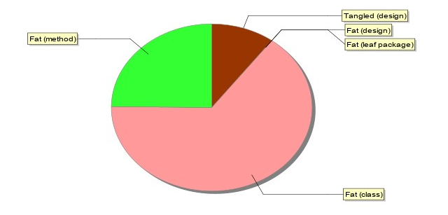
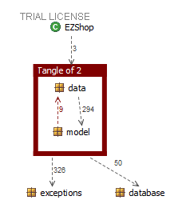

# Design assessment


```
<The goal of this document is to analyse the structure of your project, compare it with the design delivered
on April 30, discuss whether the design could be improved>
```

# Levelized structure map


# Structural over complexity chart


# Size metrics


| Metric                                    | Measure |
| ----------------------------------------- | ------- |
| Packages                                  | 7       |
| Classes (outer)                           | 49      |
| Classes (all)                             | 49      |
| NI (number of bytecode instructions)      | 8950    |
| LOC (non comment non blank lines of code) | 3848    |


# Items with XS



| Item                                                                                               | Tangled | Fat | Size | XS  |
| -------------------------------------------------------------------------------------------------- | ------- | --- | ---- | --- |
| ezshop.it.polito.ezshop.data.EZShop                                                                |         | 161 | 2942 | 749 |
| ezshop.it.polito.ezshop.database.SQLiteJDBC.init(java.lang.String, java.lang Class):java.util.List |         | 26  | 678  | 286 |
| ezshop.it.polito.ezshop                                                                            | 1,32%   | 7   | 8950 | 118 |


# Package level tangles



# Summary analysis
```
<Discuss here main differences of the current structure of your project vs the design delivered on April 30>
<Discuss if the current structure shows weaknesses that should be fixed>
```

**Reduce fatness:** in order to improove the quality of the code in terms of fatness, without changing the design choices,  we can do two changes:
1) Differentiate the db class into multiple classes<br>
2) Moove some checks (Exceptions and input controls) from API to Lists level <br>

**Reduce Tangle:** in our code the tangle comes from the loops between 'model' and 'data' packages. We decided to have a separation between them just because we wanted to have Interfaces and Classes separated.<br>

**design differences:** during the coding we decided to change the design only if strictly necessary, infact we made few changes just in terms of completing some classes by adding some methods. In terms of classes and dependencies there are no relevant changes. 
