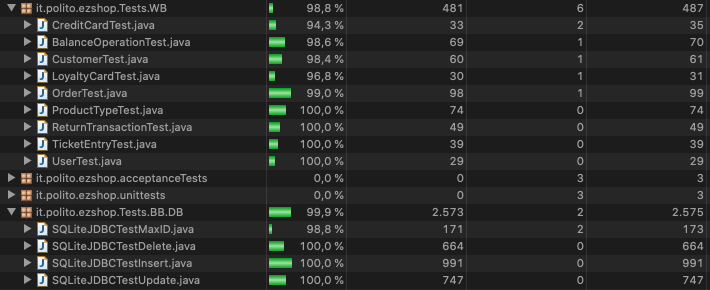

# Unit Testing Documentation

Dalmasso Luca s281316  
Kitou Mgbatou Osee Patrik s288425  
Mistruzzi Luca Guglielmo s292623 (old: s235744)  
Protopapa Matteo s290151  

# Contents

- [Black Box Unit Tests](#black-box-unit-tests)

- [White Box Unit Tests](#white-box-unit-tests)

# Black Box Unit Tests

 ### **Class *SQLiteJDBC* - method *maxID***

**Criteria for method *maxID*:**
	

 - existance of tuples in DB tables(Accounting/SaleTransactions/ReturnTransactions/Orders)
 - 

**Predicates for method *maxID*:**

| Criteria | Predicate |
| -------- | --------- |
|     existance of tuples in DB tables     |      exists     |
|          |      not exists     |

**Boundaries**:

| Criteria | Boundary values |
| -------- | --------------- |
|     existance of tuples in DB tables     |        0, +inf         |

**Combination of predicates**:

| Criteria 1 | Valid / Invalid | Description of the test case | JUnit test case |
|-------|-------|-------|-------|
|not exists| Valid |T() -> true| testMaxIDWithEmptyDB() |
|exists| Valid |T() -> true|testMaxIDWithDataOnDB()|

 ### **Class *SQLiteJDBC* - method *insert***

**Criteria for method *insert*:**
	

 - existance of row in DB with given id
 - existance of table name in DB
 - correctness of args number for given table name 

**Predicates for method *insert*:**

| Criteria | Predicate |
| -------- | --------- |
|     existance of row in DB with given id     |     exists      |
|          |     not exists       |
|    existance of table name in DB      |      exists     |
|          |    not exists        |
|     correctness of args number for given table name     |     {2, 3, 4, 7, 8} -> valid      |
|          |      invalid     |

**Boundaries**:

| Criteria | Boundary values |
| -------- | --------------- |
|    existance of row in DB with given id      |        0, 1         |
|    existance of table name in DB      |         0, 1        |
|    correctness of args number for given table name  |   0, 2, 3, 4, 7, 8 +inf    |

**Combination of predicates**:

| Criteria 1 | Criteria 2 | Criteria 3 | Valid / Invalid | Description of the test case | JUnit test case |
|-------|-------|-------|-------|-------|-------|
| not exists | exists | valid|Valid|test for each table the insert -> true|testInsertRow()|
| exists | exists | valid |Invalid|test for each table the insert -> false|testRowAlreadyExist()|
| not exists | exists | invalid |Invalid|test for each table the insert -> false|testInsertWrongNumberOfParams()|
| * | not exists | * |Invalid|T("FakeTableName", 9999, "Name") -> false| testTableNameNotExist() |

 ### **Class *SQLiteJDBC* - method *delete***

**Criteria for method *delete*:**
	

 - existance of row in DB with given id
 - existance of table name in DB 

**Predicates for method *name*:**

| Criteria | Predicate |
| -------- | --------- |
|     existance of row in DB with given id     |     exists      |
|          |     not exists       |
|    existance of table name in DB      |      exists     |
|          |    not exists        |

**Boundaries**:

| Criteria | Boundary values |
| -------- | --------------- |
|    existance of row in DB with given id      |        0, 1         |
|    existance of table name in DB      |         0, 1        |

**Combination of predicates**:

| Criteria 1 | Criteria 2 | Valid / Invalid | Description of the test case | JUnit test case |
|-------|-------|-------|-------|-------|
|exists|exists|Valid|test for each table the delete -> true|testDeleteRow()|
|not exists|exists|Valid|test for each table the delete -> false|testDeleteRowDoesntExist()|
|*|not exists|Invalid|T("FakeTableName", 9999) -> false|testTableNameNotExist()|

 ### **Class *SQLiteJDBC* - method *update***

**Criteria for method *update*:**
	

 - existance of table name in DB
 - correctness of args number for given table name 

**Predicates for method *name*:**

| Criteria | Predicate |
| -------- | --------- |
|    existance of table name in DB      |      exists     |
|          |    not exists        |
|     correctness of args number for given table name     |     {2, 3, 4, 7, 8} -> valid      |
|          |      invalid     |

**Boundaries**:

| Criteria | Boundary values |
| -------- | --------------- |
|    existance of table name in DB      |         0, 1        |
|    correctness of args number for given table name  |   0, 2, 3, 4, 7, 8 +inf    |

**Combination of predicates**:

| Criteria 1 | Criteria 2 | Valid / Invalid | Description of the test case | JUnit test case |
|-------|-------|-------|-------|-------|
| exists | valid |Valid|test for each table the update -> true|testUpdateRow()|
| exists | invalid |Invalid|test for each table the update -> false|testUpdateWrongNumberOfParams()|
| not exists | * |Invalid|T("FakeTableName", 9999, "Name") -> false| testTableNameNotExist() |

# White Box Unit Tests

### Test cases definition

| Unit name | JUnit test case |
|--|--|
|BalanceOperation|BalanceOperationTest|
|CreditCard|CreditCardTest|
|Customer|CustomerTest|
|LoyaltyCard|LoyaltyCardTest|
|Order|OrderTest|
|ProductType|ProductTypeTest|
|ReturnTransaction|ReturnTransactionTest|
|SaleTransaction|SaleTransactionTest|
|TicketEntry|TicketEntryTest|
|User|UserTest|

### Code coverage report

### Loop coverage analysis

|Unit name | Loop rows | Number of iterations | JUnit test case |
|---|---|---|---|
|||||
|||||
||||||

